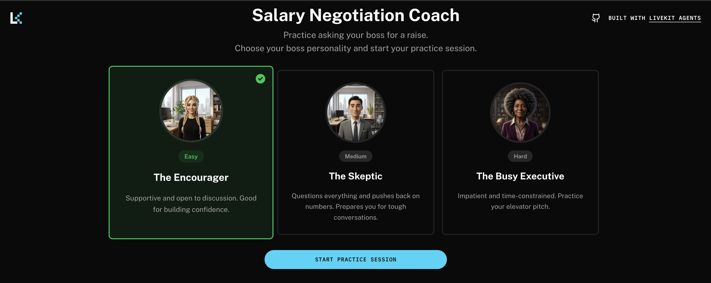

# LemonSlice Contract Negotiation Trainer

A LiveKit Agents demo that helps you practice handling procurement contract scenarios through interactive role-play sessions. Uses the lemonslice plugin to create an AI-powered coaching experience with different contract scenarios and real-time feedback.



## Features

- **Three procurement scenarios**: Practice with different contract negotiation situations (Scenario 1: Late Delivery of Parts fully implemented, Scenarios 2-3 coming soon)
- **Real-time coaching**: Get feedback and advice during your practice session
- **Smart mode switching**: Seamlessly transition between role-play and coaching modes
- **Session timer**: 3-minute practice sessions with automatic wrap-up
- **Contextual feedback**: Click "How am I doing?" to get coaching advice during your session
- **Voice interaction**: Natural conversation using Deepgram STT, Google Gemini LLM, and Cartesia TTS
- **Visual avatar**: Powered by lemonslice for procedural visual generation

## Prerequisites

- Python 3.10+
- Node.js 18+
- LiveKit account
- LemonSlice API key
- API keys for:
  - LiveKit
  - LemonSlice

## Installation

1. Clone this repository
   ```bash
   git clone <repository-url>
   cd lemonslice
   ```

2. Install backend dependencies
   ```bash
   cd agent
   uv sync
   ```

3. Install frontend dependencies
   ```bash
   cd frontend
   pnpm install
   ```

4. Copy the `.env.example` file to `.env.local` in the `agent` directory and fill in your API keys
   ```bash
   cd agent
   cp .env.example .env.local
   ```

## Configuration

Set the following environment variables in your `.env.local` file:

```bash
# LiveKit Configuration
LIVEKIT_API_KEY=your_livekit_api_key
LIVEKIT_API_SECRET=your_livekit_api_secret
LIVEKIT_URL=wss://your-project.livekit.cloud

# LemonSlice Configuration
LEMONSLICE_API_KEY=your_lemonslice_api_key

# LemonSlice Agent IDs (use dashboard-configured agents)
# These reference agents you've created in your LemonSlice dashboard
SCENARIO_1_AGENT_ID=agent_f8b4dddd8bee7a8a
# SCENARIO_2_AGENT_ID=agent_your_second_agent_id
# SCENARIO_3_AGENT_ID=agent_your_third_agent_id
```

The agent uses LiveKit Inference by default, which requires no additional API key configuration. If you prefer to use your own provider API keys, you can configure them in the agent code.

## Usage

### Backend setup

Run the agent with:

```bash
cd agent
uv run lemonslice-agent.py dev
```

The agent will start and connect to your LiveKit server.

### Frontend setup

1. Navigate to the frontend directory:
   ```bash
   cd frontend
   ```

2. Start the development server:
   ```bash
   pnpm dev
   ```

3. Open your browser and navigate to:
   ```
   http://localhost:3000
   ```

4. Select a procurement scenario and start practicing

## Procurement scenarios

The agent includes three procurement contract scenarios to practice with:

### Scenario 1: Late Delivery of Parts (Available)
- Vendor calls about a delayed shipment of repair kits
- Practice handling contract issues professionally
- Learn to gather facts, explore mitigation options, and maintain government rights
- Good for learning procurement communication fundamentals

### Scenario 2: Coming Soon
- Additional procurement scenario in development

### Scenario 3: Coming Soon
- Additional procurement scenario in development

## How it works

### Session flow

1. **Select a scenario**: Choose a procurement contract scenario from the welcome screen
2. **Role-play mode**: The AI vendor engages in a contract negotiation conversation
3. **Coaching mode**: Click "How am I doing?" to pause and get feedback from the coach
4. **Return to practice**: The coach will guide you back to continue the conversation
5. **Wrap-up**: After 3 minutes, the session automatically ends

### Coaching features

During coaching mode, the agent provides specific feedback on your negotiation approach, including what's working well and areas to improve. The coaching is contextual based on the conversation so far.

## Project structure

```
lemonslice/
├── agent/
│   ├── lemonslice-agent.py    # Main agent logic
│   ├── utils.py                # Prompt loading utilities
│   ├── prompts/                # Scenario vendor prompts
│   └── pyproject.toml          # Python dependencies
└── frontend/
    ├── components/
    │   └── app/                # React components
    ├── lib/
    │   └── scenarios.ts        # Scenario configuration
    └── app/                    # Next.js app router
```

## Extending

To modify the scenario configurations:

1. Edit the prompt files in `agent/prompts/`:
   - `scenario_1_vendor_prompt.yaml`
   - `scenario_2_vendor_prompt.yaml`
   - `scenario_3_vendor_prompt.yaml`

2. Update the scenario configurations in `frontend/lib/scenarios.ts`

To customize the coaching strategy:

1. Modify the coaching instructions in the prompt YAML files
2. Adjust the `how_am_i_doing()` function tool logic in `agent/lemonslice-agent.py`

## Built with

- [LiveKit Agents](https://docs.livekit.io/agents/) - Agent framework
- [LemonSlice Plugin](https://docs.livekit.io/agents/plugins/lemonslice/) - Avatar generation
